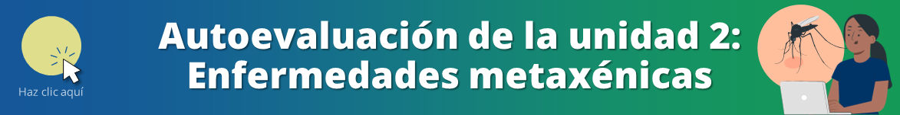

<html>
<head>
<title>U2: Enfermedades metaxenicas</title>
</head>
<body>

<h1>Unidad 2: Enfermedades metaxénicas</h1>

<i>Temas: Enfoque diagnóstico del síndrome febril. Dengue. Chikungunya. Fiebre amarilla. Zika. Bartonelosis. Leishmaniasis. Malaria. Principios de control vectorial para la prevención de arbovirosis y otras enfermedades metaxénicas.</i>

<a href="index.html">Índice</a> | <a href="u1.html">Unidad anterior</a> | <a href="u3.html">Siguiente unidad</a>

<h2>Manejo de infecciones metaxénicas asociadas a lluvias e inundaciones</h2>
<i>sube el video</i>

<h2>Cómo protegerte contra las picaduras de mosquito y el dengue</h2>

<iframe width="560" height="315" src="https://www.youtube.com/embed/jKMvqzjpA0Q?si=HCQFQtd_BdgFxb1V" title="YouTube video player" frameborder="0" allow="accelerometer; autoplay; clipboard-write; encrypted-media; gyroscope; picture-in-picture; web-share" allowfullscreen></iframe>

<h3>Infografía sobre el zancudo <i>Aedes aegypti</i></h3>

Fuente: INS. Disponible en: <a href="https://twitter.com/INS_Peru/status/691649641750872068" target="_blank">https://twitter.com/INS_Peru/status/691649641750872068</a>

<h3>Infografía sobre dengue</h3>

Fuente: INS. Disponible en: <a href="https://twitter.com/INS_Peru/status/593151410805538816" target="_blank">https://twitter.com/INS_Peru/status/593151410805538816</a>

<h2>Enfermedades transmitidas por vectores y por aguas contaminadas</h2>

<iframe width="560" height="315" src="https://www.youtube.com/embed/gUWtcNvaFmM?si=230uu37b61xu2h9n&amp;start=260" title="YouTube video player" frameborder="0" allow="accelerometer; autoplay; clipboard-write; encrypted-media; gyroscope; picture-in-picture; web-share" allowfullscreen></iframe>

<h2>Manejo clínico y vigilancia epidemiológica de dengue</h2>

<iframe width="560" height="315" src="https://www.youtube.com/embed/nqQ59QECw-8?si=hLBukewGrZg5NlcM" title="YouTube video player" frameborder="0" allow="accelerometer; autoplay; clipboard-write; encrypted-media; gyroscope; picture-in-picture; web-share" allowfullscreen></iframe>

<h2>Presentación de casos clínicos de dengue</h2>

<iframe width="560" height="315" src="https://www.youtube.com/embed/HoPDbyccxBY?si=1ham2VRvTu3ff7cx" title="YouTube video player" frameborder="0" allow="accelerometer; autoplay; clipboard-write; encrypted-media; gyroscope; picture-in-picture; web-share" allowfullscreen></iframe>

<h2>Fiebre chikungunya</h2>

<iframe width="560" height="315" src="https://www.youtube.com/embed/fVhG_i1kjbY?si=JxOvqXvxkM4UTIAs" title="YouTube video player" frameborder="0" allow="accelerometer; autoplay; clipboard-write; encrypted-media; gyroscope; picture-in-picture; web-share" allowfullscreen></iframe>

<h2>Malaria, dengue y chikungunya</h2>

<iframe width="560" height="315" src="https://www.youtube.com/embed/uVzo0se3vYQ?si=cSc3JfAvv7NuiF7v&amp;start=14" title="YouTube video player" frameborder="0" allow="accelerometer; autoplay; clipboard-write; encrypted-media; gyroscope; picture-in-picture; web-share" allowfullscreen></iframe>

<h2>Fiebre amarilla</h2>

<iframe width="560" height="315" src="https://www.youtube.com/embed/Ya2fJi6mN80?si=Lpx81bncUGRd4d2c&amp;start=50" title="YouTube video player" frameborder="0" allow="accelerometer; autoplay; clipboard-write; encrypted-media; gyroscope; picture-in-picture; web-share" allowfullscreen></iframe>

<h3>Definiciones operativas</h3>

Fuente: Protocolo sanitario de urgencia para el diagnóstico y tratamiento de pacientes con fiebre amarilla, MINSA 2016

<b>Todo caso sospechoso de fiebre amarilla debe ser hospitalizado o referido INMEDIATAMENTE.</b>

<b>Cuadro clínico</b>

El cuadro clínico de fiebre amarilla tiene 3 fases:

<ol>
  <li>“Fase de infección, congestiva o roja (0 a 5 días)</li>
  <li>Fase de remisión transitoria (horas a 2 días)</li>
  <li>Fase de intoxicación, amarilla o ictero-hemorrágica (hasta el décimo día de enfermedad)</li>
</ol>

<b>Signos de alarma</b>

<ul>
  <li>“Vómitos persistentes: más de 3 vómitos en 1 hora, o 4 vómitos en 6 horas</li>
  <li>Alteración del sensorio: excitación psicomotriz o bradipsiquia, puede tratarse de encefalopatía hepática, alteración hidroelectrolítica o hipoglicemia, entre otros</li>
  <li>Oliguria relativa a ingresos: flujo urinario < 0.5 ml/kg/hora</li>
  <li>Hipotensión arterial (ortostática)</li>
  <li>Sangrado o diátesis hemorrágica: piel, mucosas y del tracto digestivo. Realizar tacto rectal (prueba del tacto rectal y agua oxigenada). Se identifica por la producción de abundante “espuma” en el contenido de la ampolla rectal.</li>
  <li>Bradicardia persistente, con disociación pulso temperatura (signo de Faget)</li>
</ul>

<b>Caso probable de fiebre amarilla</b>

“Toda persona de cualquier edad procedente de zona endémica de fiebre amarilla, con fiebre de inicio súbito hasta 07 días de evolución, seguido de ictericia, que reside o ha visitado zonas endémicas en los últimos 14 días, con o sin vacunación contra fiebre amarilla y que presenta una o más de las siguientes manifestaciones clínicas:

<ul>
  <li>Escalofríos</li>
  <li>Cefalea intensa</li>
  <li>Dolor lumbar</li>
  <li>Mialgias</li>
  <li>Postración</li>
  <li>Congestión facial/conjuntival</li>
  <li>Náuseas y vómitos</li>
  <li>Sangrado</li>
  <li>Muerte después de haberse instalado la enfermedad con compromiso de un órgano o sistema (falla renal, hepática, otros)"</li>
</ul>

<b>Caso confirmado de fiebre amarilla</b>

<b>Por laboratorio</b>: “Todo síndrome febril o caso probable cuyo resultado de laboratorio es positivo por uno o más de los métodos siguientes:

En suero

<ul>
  <li>Aislamiento del virus de la fiebre amarilla</li>
  <li>Presencia de IgM específica para fiebre amarilla</li>
  <li>qRT-PCR para fiebre amarilla</li>
  <li>Evidencia de seroconversión en IgM en muestras pareadas, la segunda muestra deberá ser tomada después de los 14 días del inicio de síntomas (en zonas donde hay transmisión)</li>
  <li>Detección de anticuerpos de neutralización para fiebre amarilla</li>
</ul>

En tejidos

<ul>
  <li>Inmunohistoquímica específica (post mortem)</li>
  <li>qRT-PCR para fiebre amarilla</li>
</ul>

<b>Por nexo epidemiológico</b>:

“Contacto de uno o más casos sospechosos con uno o más casos confirmados, procedentes de la misma área endemo-enzoótica

"Contacto de un caso sospechoso que fallece en menos de 10 días, sin confirmación por laboratorio y que provenga de área donde hay casos confirmados

<b>Caso descartado de fiebre amarilla</b>

“Todo caso probable en el que después de la investigación epidemiológica se encuentre lo siguiente:

<ul>
  <li>Antecedente vacunal con evidencia de seroconversión</li>
  <li>Pruebas de laboratorio negativas para fiebre amarilla</li>
  <li>Ausencia de nexo epidemiológico</li>
  <li>Evidencia de otro diagnóstico alternativo, confirmado por laboratorio”</li>
</ul>

Puedes consultar las recomendaciones sobre el manejo de fiebre amarilla en el siguiente documento:

Fuente: PSU N° 16-MINSA/DVMSP/DGIESP Protocolo sanitario de urgencia para el diagnóstico y tratamiento de pacientes con fiebre amarilla. 2016.

<h2>Bartonelosis o enfermedad de Carrión</h2>

En su forma aguda, llamada fiebre de la Oroya, esta enfermedad puede tener hasta un 90% de letalidad si no se diagnostica y trata de forma precoz y adecuada. <b>Las gestantes, los infantes menores de un año y los adultos mayores de 50 años son grupos de riesgo para bartonelosis grave.</b>

<h3>Diagnóstico</h3>

El diagnóstico se hace mediante frotis de muestra de sangre y gota gruesa. También se debe obtener muestras al menos tras 24 horas, 72 horas y al día 5, para seguimiento. Para confirmar el diagnóstico, hacer seguimiento y detectar asintomáticos, se puede utilizar hemocultivo y serología.

<h3>Cuadro clínico</h3>

Tiene tres formas clínicas: aguda anemizante, crónica verrucosa, bacteriemia asintomática. Los síntomas más frecuentes según la forma clínica son:

<ul>
  <li>Forma aguda anemizante: hiporexia, malestar, decaimiento, dolor osteomuscular, artralgias, fiebre, cefalea, náuseas y vómitos, distensión, dolor abdominal, palidez de rápida instalación secundaria a anemia aguda, vértigo, disnea, ictericia, postración, trastornos del sensorio</li>
  <li>Forma verrucosa: presentación miliar, nodular o mular, sangrado de las verrugas, dolores articulares, infección dérmica sobreagregada, fiebre leve, mialgia, prurito, palidez, adenomegalia</li>
</ul>

Los individuos con bacteriemia asintomática pueden ser reservorios en las áreas endémicas.

<h3>Criterio epidemiológico para bartonelosis aguda</h3>

“Paciente residente o procedente de zonas endémicas o de nuevas áreas de transmisión de bartonelosis, o ser familiar o persona que vive en el mismo lugar de residencia de un enfermo de bartonelosis en cualquiera de las formas clínicas.

<h3>Criterio clínico para bartonelosis aguda</h3>

“Sensación de alza térmica o presencia de uno o más episodios febriles dentro de los últimos 14 días, sin la evidencia de un foco infeccioso al examen clínico. Antecede o acompaña malestar general, decaimiento, artralgias e hiporexia. En la evolución presenta anemia o ictericia.”

<h3>Tratamiento</h3>

<b>Todo paciente que cumple con el criterio epidemiológico y el criterio clínico debe iniciar inmediatamente el tratamiento contra bartonelosis aguda.</b>

El antibiótico de primera línea para niños y adolescentes menores de 14 años (menos de 45 kg), así como gestantes, es amoxicilina / ácido clavulánico. Para adolescentes mayores de 14 años y adultos (más de 45 kg), el tratamiento de primera línea es ciprofloxacino.

<b>Criterios de alarma en bartonelosis aguda</b>

<ul>
  <li>Fiebre alta o persistente</li>
  <li>Taquipnea</li>
  <li>Pulso débil</li>
  <li>Hipotensión</li>
  <li>Estado de conciencia alterado</li>
  <li>Oliguria</li>
  <li>Hipotermia</li>
  <li>Púrpura o coagulopatía</li>
  <li>Anemia severa</li>
  <li>Deterioro clínico a pesar de recibir tratamiento antimicrobiano ambulatorio</li>
</ul>

<table>
  <caption>Tabla 1. Medidas generales en pacientes con bartonelosis aguda. Fuente: Norma técnica de salud para la atención de la bartonelosis o enfermedad de Carrión en el Perú</caption>
  <tr>
    <th>Medida</th>
    <th>No hospitalizado</th>
    <th>Hospitalizado</th>
  </tr>
  <tr>
    <td>Dieta</td>
    <td>Blanda con restricción de grasas saturadas</td>
    <td>Blanda con restricción de grasas saturadas</td>
  </tr>
  <tr>
    <td>Vía</td>
    <td>Vía oral</td>
    <td>Vía oral según tolerancia Intravenosa si hay necesidad de hidratación o administración de medicamentos</td>
  </tr>
  <tr>
    <td>Reposo</td>
    <td>Relativo. Evitar ejercicios físicos intensos</td>
    <td>Absoluto si existe complicaciones</td>
  </tr>
  <tr>
    <td>Aislamiento</td>
    <td>Ninguno</td>
    <td>Sí por inmunosupresión temporal Ninguno salvo complicación específica</td>
  </tr>
  <tr>
    <td>Cuidado familiar</td>
    <td>Relativo</td>
    <td>Permanente</td>
  </tr>
  <tr>
    <td>Evaluación clínica médica</td>
    <td>Cada 48 horas</td>
    <td>Cada 12 horas</td>
  </tr>
  <tr>
    <td>Control de funciones vitales</td>
    <td>Cada 24 horas</td>
    <td>Cada 6 horas</td>
  </tr>
</table>

<h3>Bartonelosis aguda grave</h3>

“Caso probable o confirmado de bartonelosis aguda, que desde la primera consulta o en su evolución presenta alteración clínica o laboratorial, asociada a falla multiorgánica o trastornos de la perfusión y que requieren intervención para restablecer el equilibrio homeostático.”

Los pacientes con bartonelosis aguda grave, así como los pacientes con bartonelosis crónica eruptiva y bacteriemia asintomática, requieren un esquema de manejo distinto que puedes revisar en la siguiente norma técnica: 

Fuente: MINSA. Norma Técnica de Salud para la Atención de la Bartonelosis o Enfermedad de Carrión en el Perú. 2004

<h2>Infecciones por Bartonella cutánea</h2>

<iframe width="560" height="315" src="https://www.youtube.com/embed/AKLIU16apsU?si=uA-yeNAY5v-h-RTY&amp;start=128" title="YouTube video player" frameborder="0" allow="accelerometer; autoplay; clipboard-write; encrypted-media; gyroscope; picture-in-picture; web-share" allowfullscreen></iframe>

<h2>Leishmaniasis</h2>

<iframe width="560" height="315" src="https://www.youtube.com/embed/jmeFXGe2Zjk?si=co4AP8I3k9emjV9u&amp;start=81" title="YouTube video player" frameborder="0" allow="accelerometer; autoplay; clipboard-write; encrypted-media; gyroscope; picture-in-picture; web-share" allowfullscreen></iframe>

<b>Repasa lo aprendido en la autoevaluación de esta unidad</b>&#128221;

A continuación encontrarás preguntas de opción múltiple sobre los contenidos que hemos visto.

<a href="index.html">&#127968; Inicio</a> | <a href="u1.html">&#9194; Unidad anterior</a> | <a href="u3.html">&#9193; Siguiente unidad</a>

Oficina de Inteligencia e Información Sanitaria OIIS, EsSalud, Perú - 2024

