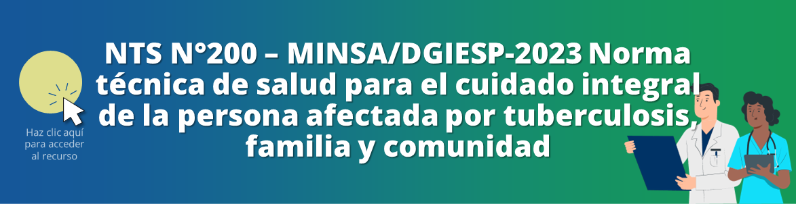

<html>
<head>
<title>Unidad 3: Principales síndromes e infecciones</title>
</head>
<body>

<h1>Unidad 3: Principales síndromes e infecciones</h1>

<i>Temas: Infecciones respiratorias: IRAs. Influenza. COVID-19. Neumonía adquirida en la comunidad. Tuberculosis. Asma. Infecciones gastrointestinales: EDAs. Cólera. Shigelosis. Salmonelosis. Parasitosis.</i>

<a href="index.html">Inicio</a> | <a href="u2.html">Unidad anterior</a> | <a href="u4.html">Siguiente unidad</a>

<h2>Infecciones respiratorias: Medidas prácticas para evitar contagios</h2>

<iframe src="https://www.youtube.com/embed/pyC1Lce3APw?si=M4pOjVXb20PW1bki&amp;start=53" 
frameborder="0" allow="accelerometer; autoplay; clipboard-write; encrypted-media; gyroscope; picture-in-picture; web-share" allowfullscreen class="video"></iframe>

<h3>Infografía sobre medidas para prevenir el contagio de enfermedades respiratorias</h3>

<h2>IRAs</h2>

<iframe src="https://www.youtube.com/embed/2_l4nmA9H28?si=66KLXNAZjreSNR_p&amp;start=235" 
frameborder="0" allow="accelerometer; autoplay; clipboard-write; encrypted-media; gyroscope; picture-in-picture; web-share" allowfullscreen class="video"></iframe>

<b>Definición</b>

Infección que compromete una o más partes del aparato respiratorio con duración menor de 14 días causada por un agente infeccioso. Puede tener estos síntomas o signos, entre otros:

<ul>
  <li>Tos</li>
  <li>Rinorrea</li>
  <li>Obstrucción nasal</li>
  <li>Odinofagia</li>
  <li>Otalgia</li>
  <li>Disfonía</li>
  <li>Respiración ruidosa</li>
  <li>Dificultad respiratoria</li>
  <li>Con o sin fiebre</li>
</ul>

En desastres, se ve un incremento de IRAs hasta 3 meses después del evento.

<h2>COVID-19</h2>

<iframe src="https://www.youtube.com/embed/tuL6IGkkiOQ?si=zuLNy9tmoiaviFxQ&amp;start=183" 
frameborder="0" allow="accelerometer; autoplay; clipboard-write; encrypted-media; gyroscope; picture-in-picture; web-share" allowfullscreen class="video"></iframe>

<h2>Diferencias y similitudes TB, resfrío, gripe y COVID-19</h2>

<iframe src="https://www.youtube.com/embed/pXE4UFKk4Ts?si=eJjv4R5vMysMJrdN&amp;start=29" 
frameborder="0" allow="accelerometer; autoplay; clipboard-write; encrypted-media; gyroscope; picture-in-picture; web-share" allowfullscreen class="video"></iframe>

<h2>Neumonía adquirida en la comunidad</h2>

<iframe src="https://www.youtube.com/embed/U79u1x7lo3c?si=My7H6ScCvnQrY7pr" 
frameborder="0" allow="accelerometer; autoplay; clipboard-write; encrypted-media; gyroscope; picture-in-picture; web-share" allowfullscreen class="video"></iframe>

<h2>Neumonía en pediatría</h2>

<iframe src="https://www.youtube.com/embed/wS87slHLD7s?si=HQ7duu4OfoApMq9Y&amp;start=88" 
frameborder="0" allow="accelerometer; autoplay; clipboard-write; encrypted-media; gyroscope; picture-in-picture; web-share" allowfullscreen class="video"></iframe>

<b>Cuadro clínico</b>

Los síntomas y signos en un niño con neumonía incluyen:

<ul>
  <li>Cuadro previo viral - infección respiratoria alta</li>
  <li>Fiebre</li>
  <li>Tos</li>
  <li>Taquipnea</li>
  <li>Dolor abdominal</li>
  <li>Aleteo nasal</li>
  <li>Retracciones</li>
  <li>Quejido</li>
  <li>Cianosis</li>
</ul>

Los criterios de hospitalización por neumonía en niños son:

<ul>
  <li>Hipoxemia (saturación < 92%)</li>
  <li>Lactante</li>
  <li>Taquipnea severa</li>
  <li>Distrés respiratorio</li>
  <li>Signos de deshidratación</li>
  <li>Comorbilidades</li>
  <li>Falla de tratamiento ambulatorio</li>
  <li>Neumonía complicada</li>
</ul>

<h2>Asma: abordaje y manejo</h2>

<iframe src="https://www.youtube.com/embed/YU9hWSPvRDc?si=cKU16NQLOOUAa6rA&amp;start=127" 
frameborder="0" allow="accelerometer; autoplay; clipboard-write; encrypted-media; gyroscope; picture-in-picture; web-share" allowfullscreen class="video"></iframe>

<h2>Mejoras en el abordaje de la TBC en el Perú: Actualización de la normativa vigente para su manejo</h2>

<iframe src="https://www.youtube.com/embed/fAYvgzYQRT4?si=93w4jTvKnEvlxiHk&amp;start=141" 
frameborder="0" allow="accelerometer; autoplay; clipboard-write; encrypted-media; gyroscope; picture-in-picture; web-share" allowfullscreen class="video"></iframe>

<b>¿Quiénes deben recibir terapia preventiva de tuberculosis?</b>

<ul>
  <li>Menores de 5 años contactos de caso índice con TB pulmonar, e independientemente del PPD</li>
  <li>Niños >= de 5 años, adolescentes, jóvenes, adultos y adultos mayores que son contactos de caso índice de TB pulmonar con resultado del PPD igual o mayor a 10 mm</li>
  <li>Personas con diagnóstico de infección por VIH independiente del resultado del PPD</li>
  <li>Personas con diagnóstico de TB latente detectada sistemáticamente: PPL, personal penitenciario, personal de la salud, personas sin hogar, personas que consumen drogas y otras personas con vulnerabilidad sanitaria</li>
  <li>Personas de 5 años a más de edad con conversión reciente (menos de 2 años) del PPD contactos de caso índice con TB pulmonar</li>
  <li>Persona con conversión reciente (menos de 2 años) del PPD o en personal de la salud, personas que atienden a PPL y otras personas con vulnerabilidad sanitaria</li>
  <li>Personas con diagnóstico de TB latente con terapias prolongadas con corticoides o inmunosupresores, comorbilidades</li>
</ul>

Puedes consultar las recomendaciones sobre el manejo de tuberculosis en el siguiente documento:

Puedes consultar la directiva sobre la vigilancia epidemiológica de tuberculosis en el siguiente documento:

<h2>Enfermedad diarreica aguda (EDA)</h2>

Fuente: Norma Técnica de Salud N° 190-MINSA/CDC-2022 Norma técnica de salud para la vigilancia epidemiológica de la enfermedad diarreica aguda (EDA) en el Perú

<h3>EDA acuosa</h3>

“Cuadro en el que el paciente presenta aumento en frecuencia (3 o más veces en 24 horas), fluidez y/o volumen de las deposiciones en comparación a lo habitual, con pérdida variable de agua y electrolitos y cuya duración es menor de catorce (14) días

<h3>EDA disentérica</h3>

“Cuadro en el que el paciente presenta aumento en frecuencia y fluidez de las deposiciones, de volumen escaso o moderado y que además evidencia en las heces sangre visible y moco

<h3>Caso de enfermedad diarreica persistente</h3>

“Todo paciente que presenta un cuadro diarreico que se inicia como una diarrea aguda infecciosa, pero que se prolonga por catorce (14) días o más

<h3>Hospitalizado por EDA</h3>

“Paciente internado con diagnóstico de EDA, con permanencia igual o mayor a 24 horas

En la clasificación se debe especificar si se trata de una EDA acuosa o disentérica según la definición.”

Puedes consultar las recomendaciones sobre el manejo de EDA en el siguiente documento:

Puedes consultar la directiva sobre la vigilancia epidemiológica de EDA en el siguiente documento:

Fuente: MINSA. Norma Técnica de Salud N° 190-MINSA/CDC-2022 Norma técnica de salud para la vigilancia epidemiológica de la enfermedad diarreica aguda (EDA) en el Perú. 2022

<h2>Cólera</h2>

<iframe src="https://www.youtube.com/embed/G4ceBUtmG0U?si=y7Ddi6ifFP7kBpJL" 
frameborder="0" allow="accelerometer; autoplay; clipboard-write; encrypted-media; gyroscope; picture-in-picture; web-share" allowfullscreen class="video"></iframe>

<h3>Definiciones operativas</h3>

Fuente: Norma Técnica de Salud N° 190-MINSA/CDC-2022 Norma técnica de salud para la vigilancia epidemiológica de la enfermedad diarreica aguda (EDA) en el Perú

<b>Caso sospechoso de cólera</b>

“Persona de cualquier edad que presenta un cuadro de diarrea acuosa de aparición brusca que lleva rápidamente a la deshidratación.
“Esta definición tiene mayor utilidad durante un brote o epidemia, con el fin de captar precozmente los casos

<b>Caso probable de cólera</b>

<ol>
  <li>“Persona de cualquier edad que presenta bruscamente un cuadro clínico de diarrea acuosa con o sin vómitos, con deshidratación severa o shock, y sin presencia de fiebre; o</li>
  <li>“Persona de cualquier edad que muere por un cuadro de enfermedad diarreica aguda acuosa</li>
</ol>

“Esta definición tiene mayor utilidad en ausencia de actividad epidémica o cuando la incidencia es baja, cada caso debe ser investigado

<b>Caso confirmado de cólera</b>

“Caso sospechoso o probable con aislamiento por coprocultivo de <i>Vibrio cholerae</i> O1 u O139 u otro método de diagnóstico (PCR, entre otros)

<ul>
  <li>“Todo caso probable en una localidad donde se han confirmado casos de cólera en las últimas 2 semanas</li>
  <li>“Todo caso probable durante un brote o epidemia donde se ha confirmado el Vibrio cholerae O1 u O139 en los nuevos casos</li>
  <li>“Todo caso probable que es contacto familiar de un caso confirmado</li>
</ul>

<b>Caso compatible de cólera</b>

“Cualquier caso clasificado como sospechoso o probable que no puede ser confirmado o descartado en un lapso de treinta (30) días posteriores a la clasificación inicial, en ausencia de actividad epidémica.

<b>Caso de portador asintomático de <i>Vibrio cholerae</i></b>

“Toda persona en quien se ha aislado <i>Vibrio cholerae</i> O1 y O139, sin evidencia de cuadro clínico

<b>Caso descartado de cólera</b>

“Todo caso sospechoso o probable en el que por coprocultivo de <i>Vibrio cholerae</i> no se aísla el agente etiológico o no se confirma por otro método, y sin nexo epidemiológico.”

Fuente: MINSA. Norma Técnica de Salud N° 190-MINSA/CDC-2022 Norma técnica de salud para la vigilancia epidemiológica de la enfermedad diarreica aguda (EDA) en el Perú. 2022

<h2>Parasitosis</h2>

<iframe src="https://www.youtube.com/embed/bN5t_nBHVbM?si=7jzcKHNHihZxzPL5" 
frameborder="0" allow="accelerometer; autoplay; clipboard-write; encrypted-media; gyroscope; picture-in-picture; web-share" allowfullscreen class="video"></iframe>

<h2>Infecciones de tracto urinario</h2>

<iframe src="https://www.youtube.com/embed/8jvfW0RN2kE?si=qjwNBvFiIwLgjti7&amp;start=112" 
frameborder="0" allow="accelerometer; autoplay; clipboard-write; encrypted-media; gyroscope; picture-in-picture; web-share" allowfullscreen class="video"></iframe>

<h2>Autoevaluación</h2>

Repasa lo aprendido con las preguntas de opción múltiple <a href="u3_autoeval.html">a continuación &#128221;</a>

<a href="index.html">&#127968; Inicio</a> | <a href="u2.html">&#9194; Unidad anterior</a> | <a href="u3_autoeval.html">&#9997; Autoevaluación U3</a> | <a href="u4.html">&#9193; Siguiente unidad</a>

Oficina de Inteligencia e Información Sanitaria OIIS, EsSalud, Perú - 2024

