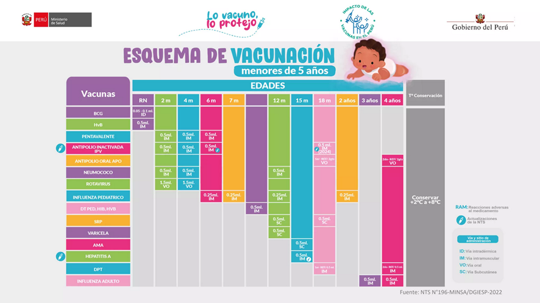
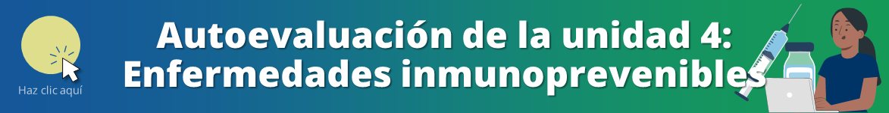

<html>
<head>
<title>Unidad 4: Enfermedades inmunoprevenibles</title>
</head>
<body>

<h1>Unidad 4: Enfermedades inmunoprevenibles</h1>

<i>Temas: Esquema de vacunación vigente. Sarampión. Enfermedades eruptivas infantiles. Tos ferina. Meningitis.</i>

<a href="index.html">Inicio</a> | <a href="u3.html">Unidad anterior</a> | <a href="u5.html">Siguiente unidad</a>

<h2>Actualización del esquema de vacunación</h2>

<iframe width="560" height="315" src="https://www.youtube.com/embed/3Have7Hsjq8?si=-2SmwiInv0GrDSfO" title="YouTube video player" frameborder="0" allow="accelerometer; autoplay; clipboard-write; encrypted-media; gyroscope; picture-in-picture; web-share" allowfullscreen></iframe>

<h3>Infografía sobre el esquema de vacunación</h3>

Fuente: MINSA

<h2>Enfermedades eruptivas infantiles</h2>

<iframe width="560" height="315" src="https://www.youtube.com/embed/kPnkDPnPr1o?si=NWNb4mc8Ogvf-gE9&amp;start=105" title="YouTube video player" frameborder="0" allow="accelerometer; autoplay; clipboard-write; encrypted-media; gyroscope; picture-in-picture; web-share" allowfullscreen></iframe>

<h2>Sarampión: Diagnóstico diferencial y vigilancia epidemiológica</h2>

<iframe width="560" height="315" src="https://www.youtube.com/embed/TLb-6tLU18U?si=v2X8hFvUd3BJyI4l" title="YouTube video player" frameborder="0" allow="accelerometer; autoplay; clipboard-write; encrypted-media; gyroscope; picture-in-picture; web-share" allowfullscreen></iframe>

<h2>Tos convulsiva (coqueluche): Generalidades</h2>

<iframe width="560" height="315" src="https://www.youtube.com/embed/DawsGAp7l2g?si=wjuwkJjvk4PMTEBF&amp;start=66" title="YouTube video player" frameborder="0" allow="accelerometer; autoplay; clipboard-write; encrypted-media; gyroscope; picture-in-picture; web-share" allowfullscreen></iframe>

<h2>Meningitis: Generalidades</h2>

<iframe width="560" height="315" src="https://www.youtube.com/embed/lTtaidsGi88?si=kwSi6qIQL_dismxy" title="YouTube video player" frameborder="0" allow="accelerometer; autoplay; clipboard-write; encrypted-media; gyroscope; picture-in-picture; web-share" allowfullscreen></iframe>

<h2>Autoevaluación</h2>

Repasa lo aprendido con las preguntas de opción múltiple <a href="u4_autoeval.html">a continuación &#128221;</a>

<a href="index.html">&#127968; Inicio</a> | <a href="u3.html">&#9194; Unidad anterior</a> | <a href="u4_autoeval.html">&#9997; Autoevaluación U4</a> | <a href="u5.html">&#9193; Siguiente unidad</a>

Oficina de Inteligencia e Información Sanitaria OIIS, EsSalud, Perú - 2024

