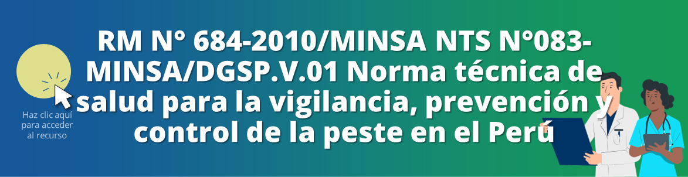

<html>
<head>
<title>Unidad 5: Enfermedades zoonóticas y otras</title>
</head>
<body>

<h1>Unidad 5: Enfermedades zoonóticas y otras</h1>

<i>Temas: Leptospirosis. Peste. Rabia. Síndrome de Guillain Barré.</i>

<a href="index.html">Inicio</a> | <a href="u4.html">Unidad anterior</a> | <a href="u6.html">Siguiente unidad</a>

<h2>Leptospirosis: Contaminación del agua y alimentos</h2>

<iframe src="https://www.youtube.com/embed/x4YNzmd-ukc?si=P-zYwtGE9ST2OcQf&amp;start=231" 
frameborder="0" allow="accelerometer; autoplay; clipboard-write; encrypted-media; gyroscope; picture-in-picture; web-share" allowfullscreen class="video"></iframe>

<h2>Peste</h2>

<iframe src="https://www.youtube.com/embed/RRJJFnOm1eU?si=wN4iLghsN8bmTr2H&amp;start=514" 
frameborder="0" allow="accelerometer; autoplay; clipboard-write; encrypted-media; gyroscope; picture-in-picture; web-share" allowfullscreen class="video"></iframe>

<h3>Definiciones</h3>

Fuente: NTS N°083-MINSA/DGSP.V.01 Norma técnica de salud para la vigilancia, prevención y control de la peste en el Perú

<b>Caso sospechoso</b>

“Paciente con presentación clínica compatible, y con antecedentes epidemiológicos consistentes en:

<ul>
  <li>“Exposición a humanos o animales infectados y/o</li>
  <li>“Evidencia de picaduras de pulgas y/o</li>
  <li>“Residencia o viaje a un área endémica conocida, dentro de los 10 días previos</li>
</ul>

<b>Caso probable</b>

“Dependerá de en qué área se presente el caso sospechoso.

En área potencialmente nueva o re-emergente: un caso probable es un paciente que cumple la definición de caso sospechoso y al menos 2 de las siguientes pruebas positivas:

<ul>
  <li>Microscopía: muestra de bubón, sangre o esputo que contiene cocobacilos gran negativos, bipolares después de tinción Wayson o Giemsa</li>
  <li>Antígeno F1 detectado en aspirado de bubón, sangre o esputo</li>
  <li>Una serología anti-F1 única sin evidencia de infección o inmunización previa con <i>Yersinia pestis</i> y</li>
  <li>Detección de <i>Y. pestis</i> por PCR en aspirado de bubón, sangre o esputo</li>
</ul>

En área endémica conocida: un caso probable es un paciente que cumple la definición de caso sospechoso y al menos 1 de las pruebas positivas mencionadas en el acápite anterior.

<b>Caso confirmado</b>

“Paciente que cumple la definición de caso sospechoso más:

<ul>
  <li>Un aislamiento de una muestra clínica única identificada como <i>Y. pestis</i> (morfología de colonia y 2 de las 4 siguientes pruebas positivas: lisis por bacteriófago de cultivos a 20-25°C y 37°C; detección de antígeno; PCR; perfil bioquímico de <i>Y. pestis</i>); o</li>
  <li>Una elevación en 4 títulos de anticuerpos anti-F1 en muestras de suero pareadas; o</li>
  <li>En áreas endémicas donde no pueda ser realizada otra prueba confirmatoria, una prueba rápida positiva usando una prueba inmunocromatográfica para detectar antígeno F1”</li>
</ul>

Puedes consultar las recomendaciones sobre el manejo de la peste en el siguiente documento:

Fuente: MINSA. RM N° 684-2010/MINSA NTS N°083-MINSA/DGSP.V.01 Norma técnica de salud para la vigilancia, prevención y control de la peste en el Perú. 2010.

<h2>Rabia</h2>
<h3>Definiciones</h3>

Fuente: Norma Técnica de Salud N° 131 – MINSA/2017/DGIESP Norma técnica de salud para la vigilancia, prevención y control de la rabia humana en el Perú

<b>Caso probable de rabia canina</b>

“Perro con cambio de conducta que se esconde en lugares oscuros o muestra intranquilidad, posteriormente se torna agresivo, con tendencia a morder objetos y todo lo que se mueve, hay sialorrea, alteración del ladrido por parálisis de músculos laríngeos y cuerdas vocales, el animal tiende a fugar de su domicilio, luego sobreviene incoordinación muscular, parálisis de las extremidades posteriores y muerte. Con un tiempo de enfermedad no mayor a 10 días, algunas veces el cuadro clínico solo muestra síntomas de parálisis y muerte

<b>Caso confirmado de rabia canina</b>

“Con un resultado positivo de cualquiera de las pruebas de laboratorio

<b>Caso probable de rabia humana</b>

“Paciente con síndrome neurológico agudo (encefalitis) dominado por formas de hiperactividad, seguido de síndromes paralíticos que progresan hacia el coma y muerte por insuficiencia respiratoria entre 4 y 10 días después de la aparición del primer síntoma. Con antecedente de mordedura, arañazo o contacto con un animal sospechoso de rabia u otra condición de exposición (trasplantes, riesgo ocupacional).

<b>Caso confirmado de rabia humana</b>

“Un caso probable que es confirmado por laboratorio, mediante los resultados positivos de las pruebas de inmunofluorescencia directa (IFD), cultivo celular, inoculación en ratones o RT-PCR, anticuerpos neutralizantes en líquido cefalorraquídeo.”

Puedes consultar las recomendaciones sobre el manejo de la rabia en el siguiente documento:

Fuente: MINSA. Norma Técnica de Salud N° 131 – MINSA/2017/DGIESP Norma técnica de salud para la vigilancia, prevención y control de la rabia humana en el Perú. 2017.

<h2>¿Qué es el síndrome de Guillain Barré?</h2>

<iframe src="https://www.youtube.com/embed/z6gHq-DHcYo?si=40LR7Je2vFTAhSFh&amp;start=16" 
frameborder="0" allow="accelerometer; autoplay; clipboard-write; encrypted-media; gyroscope; picture-in-picture; web-share" allowfullscreen class="video"></iframe>

<h2>Autoevaluación</h2>

Repasa lo aprendido con las preguntas de opción múltiple <a href="u5_autoeval.html">a continuación &#128221;</a>

<a href="index.html">&#127968; Inicio</a> | <a href="u4.html">&#9194; Unidad anterior</a> | <a href="u5_autoeval.html">&#9997; Autoevaluación U5</a> | <a href="u6.html">&#9193; Siguiente unidad</a>

Oficina de Inteligencia e Información Sanitaria OIIS, EsSalud, Perú - 2024

