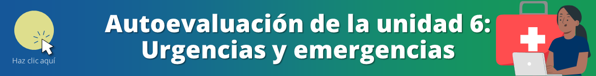

<html>
<head>
<title>Unidad 6: Urgencias y emergencias en desastres</title>
</head>
<body>

<h1>Unidad 6: Urgencias y emergencias en desastres</h1>

<i>Temas: Primeros auxilios y estabilización de pacientes. Traumatismos y caídas. Quemaduras. Golpe de calor. Emergencias obstétricas. Accidentes cerebrovasculares. Accidentes por animales ponzoñosos.</i>

<a href="index.html">Inicio</a> | <a href="u5.html">Unidad anterior</a>

<h2>Primeros auxilios</h2>

<iframe src="https://www.youtube.com/embed/UQEp3D3WHeM?si=ivIjiLjNxxX7-tdT&amp;start=8" 
frameborder="0" allow="accelerometer; autoplay; clipboard-write; encrypted-media; gyroscope; picture-in-picture; web-share" allowfullscreen class="video"></iframe>

<h2>Urgencias por agentes físicos: quemaduras y lesiones por electricidad</h2>

<iframe src="https://www.youtube.com/embed/VboWJ4pS1Lw?si=Hrfg75JdvIWQM3DA" 
frameborder="0" allow="accelerometer; autoplay; clipboard-write; encrypted-media; gyroscope; picture-in-picture; web-share" allowfullscreen class="video"></iframe>

<h2>Accidentes cerebrovasculares</h2>

<iframe src="https://www.youtube.com/embed/uaeY5ddBp2o?si=iFf-GfBHtMhOOze5" 
frameborder="0" allow="accelerometer; autoplay; clipboard-write; encrypted-media; gyroscope; picture-in-picture; web-share" allowfullscreen class="video"></iframe>

<h2>Manejo de emergencias obstétricas</h2>

<iframe src="https://www.youtube.com/embed/XScCJuZvQyo?si=ZIG8LnjhMXICjJni&amp;start=78" 
frameborder="0" allow="accelerometer; autoplay; clipboard-write; encrypted-media; gyroscope; picture-in-picture; web-share" allowfullscreen class="video"></iframe>

<b>Signos de alarma obstétrica</b>

<ul>
  <li>Dolor o contracciones uterinas</li>
  <li>Sangrado vaginal</li>
  <li>Pérdida de líquido amniótico</li>
  <li>Vómitos exagerados</li>
  <li>Edema de miembros inferiores y superiores</li>
  <li>Disminución o ausencia de movimientos fetales</li>
  <li>Cefalea</li>
</ul>

<h2>EsSalud te orienta cómo actuar frente al golpe de calor en los niños</h2>

<iframe src="https://www.youtube.com/embed/wYvgW20neqg?si=nMe2cJ-Fuak7hTF_" 
frameborder="0" allow="accelerometer; autoplay; clipboard-write; encrypted-media; gyroscope; picture-in-picture; web-share" allowfullscreen class="video"></iframe>

<h2>Prevención y control de accidentes por animales ponzoñosos en el Perú</h2>

<iframe src="https://www.youtube.com/embed/nHXPxTwrXe8?si=No0tv5JGO0-M8qZ8&amp;start=178" 
frameborder="0" allow="accelerometer; autoplay; clipboard-write; encrypted-media; gyroscope; picture-in-picture; web-share" allowfullscreen class="video"></iframe>

Ante un accidente ofídico:

<ul>
  <li>Tranquilizar e inmovilizar al paciente</li>
  <li>Lavar suavemente la zona de la mordedura con abundante agua y jabón</li>
  <li>Inmovilizar la parte afectada con una férula, entablillado u otros</li>
  <li>Identificar al animal agresor cuando sea posible</li>
  <li>Comunicar inmediatamente la ocurrencia del accidente al establecimiento de salud más cercano a la brevedad posible</li>
  <li>Trasladar al paciente inmovilizado al establecimiento de salud más cercano a la brevedad posible</li>
  <li>No aplicar torniquetes ni ligaduras en el miembro afectado</li>
  <li>No hacer cortes ni succionar el veneno, no aplicar medidas caseras como hielo, "piedra negra", corriente eléctrica, kerosene y otros</li>
</ul>

<h2>Autoevaluación</h2>

Repasa lo aprendido con las preguntas de opción múltiple <a href="u6_autoeval.html">a continuación &#128221;</a>

<a href="index.html">&#127968; Inicio</a> | <a href="u5.html">&#9194; Unidad anterior</a> | <a href="u6_autoeval.html">&#9997; Autoevaluación U6</a>

Oficina de Inteligencia e Información Sanitaria OIIS, EsSalud, Perú - 2024

